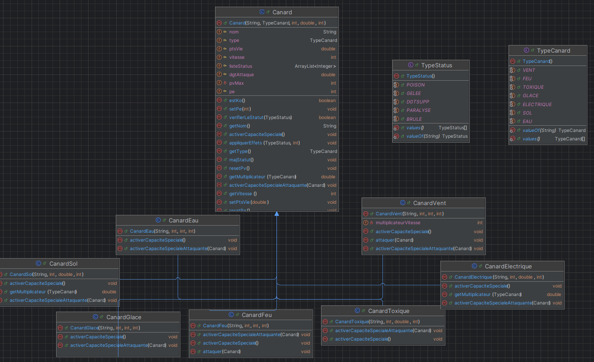

# Canard Battle - BASTIEN BALMES

## Questionnements sur la modélisation

### 1. Quelles classes pourraient être abstraites ?
La classe `Canard` pourrait être abstraite, vu qu'on a plusieurs types de canards qui héritent de cette classe. Elle aurait des méthodes communes à tous les canards, mais certaines actions spécifiques seraient définies dans les classes filles

### 2. Quels comportements communs pourraient être définis dans une interface ?
Des comportements comme `attaquer()` ou `activerCapaciteSpeciale()` pourraient être définis dans une interface. Chaque type de canard pourrait implémenter cette interface de manière spécifique, en ayant une structure commune

### 3. Comment représenter un changement de statut (par exemple, brûlé ou paralysé) dans la modélisation ?
Les statuts comme "brûlé" ou "paralysé" sont représentés par un `enum` (`TypeStatus`). Cet enum permet de gérer facilement les effets de statut et facilite l'ajout de nouveaux statuts

### 4. Quels seraient les avantages d’utiliser une classe ou une interface supplémentaire pour gérer les capacités spéciales ?
Une interface supplémentaire pour les capacités spéciales permettrait de mieux gérer les capacités spéciale de nos canard. Chaque capacité spéciale serais implémenter indépendamment des autres

### 5. Quels défis sont associés à l’extensibilité du modèle pour ajouter de nouveaux types de canards ou de nouvelles capacités ?
Le principal défi est de s’assurer que les nouveaux types de canards et de capacités n'entrent pas en conflit avec les existants. Une interfaces ou une classes abstraites faciliterais l'ajout de nouveaux éléments

---

## Modifications et Réflexion Conceptuelle

### 1. Canard abstrait
J'ai choisi de rendre la classe `Canard` abstraite, car tous les canards partagent certaines propriétés, mais chaque type de canard a des comportements spécifiques. Cette approche évite la duplication du code et facilite l'ajout de nouveaux types de canards

### 2. Enum pour les statuts
Pour gérer les statuts comme "brûlé", "paralysé", ou "gelé", j'ai utilisé un `enum` (`TypeStatus`). Cela permet une meilleure organisation et facilite l'ajout de nouveaux statuts

### 3. ArrayList pour stocker la durée des statuts
J'ai choisi une `ArrayList<Integer>` pour stocker la durée de chaque statut, ce qui permet de gérer facilement plusieurs statuts en même temps. Les indices de la liste sont liés aux indices de l'`enum`

---

## Description des choix techniques

### 1. Effets de statut
- **Modifications apportées :**
  - Utilisation d'un `enum` pour les statuts
  - Stockage des durées des statuts dans une `ArrayList<Integer>`
- **Pourquoi ce choix ?**
  - L'`enum` permet d'éviter des erreurs avec les String par exemple, et facilite l'ajout de nouveaux statuts
  - L'`ArrayList` permet une gestion simple de la durée des statuts

### 2. Points d'Énergie (PE)
- **Modifications apportées :**
  - Ajout d'une variable `pe` pour suivre l'énergie de chaque canard
  - Vérification des PE avant chaque action pour éviter des attaques sans énergie
- **Pourquoi ce choix ?**
  - Une varaible private dans l'objet canard suffit pour gérer se comportement

### 3. Attaques Critiques
- **Modifications apportées :**
  - Ajout d'une probabilité de 10% pour un coup critique (dégâts x2)
  - Gestion via un nombre aléatoire généré à chaque attaque

### 4. Gestion des Statuts et Attaques avec Effets
- **Modifications apportées :**
  - Gestion des effets de statut directement dans les méthodes d'attaque et de capacité spéciale
  - Mise à jour automatique des statuts à chaque tour
- **Pourquoi ce choix ?**
  - Facilite l'ajout de nouveaux effets
  - Permet de gérer facilement la durée des statut
    
### 6. Nouveaux Types de Canards
- **Modifications apportées :**
  - Ajout des classes `CanardElectrique`, `CanardToxique` et `CanardSol`
  - Modification de l'`enum TypeCanard` pour inclure les nouveaux types de canards
- **Pourquoi ce choix ?**
  - L'`enum TypeCanard` permet de ne pas faire d'erreur de création comme avec une String par exemple

### 2. Attaques Spéciales Uniques
- **Modifications apportées :**
  - Ajout de la méthode `activerCapaciteSpecialeAttaquante(Canard cibleCanard)` dans la classe `Canard`
  - Implémentation de `activerCapaciteSpecialeAttaquante(Canard cibleCanard)` dans `CanardElectrique`, `CanardToxique` et `CanardSol`
- **Pourquoi ce choix ?**
  - L'utilisation d'une méthode `activerCapaciteSpecialeAttaquante(Canard cibleCanard)` permet d'ajouter des attaques uniques

### 3. Personnalisation et Progression
- **Modifications apportées :**
  - Ajout d’une limite pour les PV et PA pour la création des canards
  - Stockage des statistiques maximales (`pvMax`, `paMax`)
  - Ajout de la méthode `evoluer()` pour augmenter les statistiques d'un canard
- **Pourquoi ce choix ?**
  - Limiter les stats
  - La méthode `evoluer()` évite de devoir redéfinir entièrement un canard après une victoire

### 4. Objets Utilisables
- **Modifications apportées :**
  - Création d’une classe `Objet`
  - Ajout des potions qui extends `Objet`
- **Pourquoi ce choix ?**
  - L’utilisation d’une classe `Objet` permet d’ajouter facilement de nouveaux items

### 5. Amélioration de la Boucle de Combat
- **Modifications apportées :**
  - Ajout d’un système permettant de rejouer avec les mêmes canards sans réinitialisation
- **Pourquoi ce choix ?**
  - Permet d’améliorer l’expérience utilisateur

---

## Diagramme UML des classes

